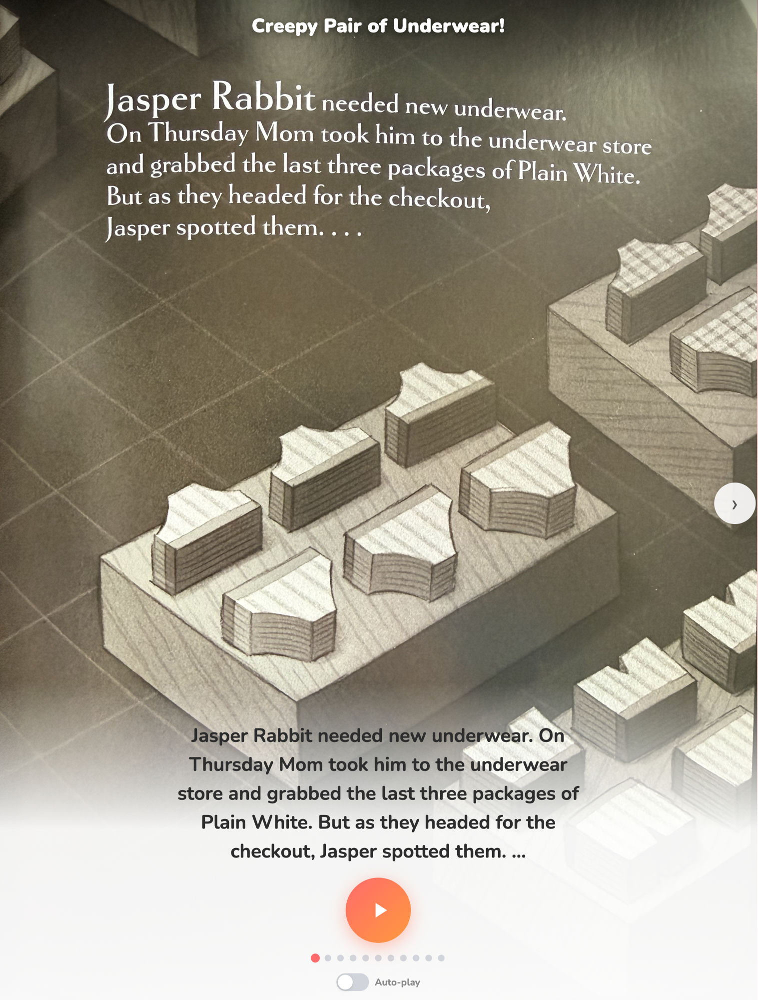
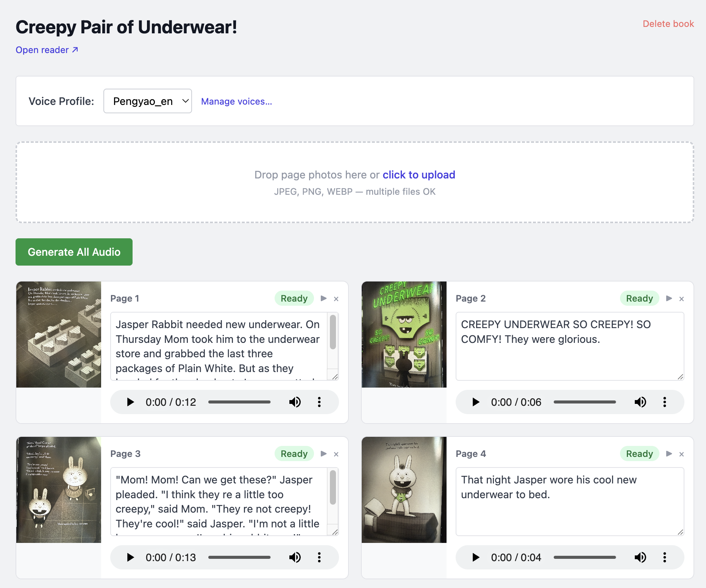

# Storytime

**Your kid's favorite book. Your voice. Even when you're not there.**

Take any picture book your child loves. Photograph each page, upload it, and record 5–10 seconds of your voice. Storytime does the rest — generating audio for every page in your voice using local AI. A few minutes later, your child can tap play and hear the whole book read aloud by you, in your voice, on their own.

Free. No internet required. Runs entirely on your Mac.

| Kids reader | Parent portal |
|---|---|
|  |  |

---

## How it works

1. **Photograph the pages** — take a photo of each page with your phone and upload them. Text is extracted automatically via OCR.
2. **Record 5–10 seconds of your voice** — read any sentence aloud and save the clip.
3. **Hit Generate** — Storytime clones your voice and produces audio for every page. Takes a few minutes on Apple Silicon.
4. **Hand it to your kid** — they tap ▶ and the book reads itself in your voice, page by page.

---

## Requirements

- **Mac with Apple Silicon** (M1 or later)
- **macOS 13 Ventura or later**
- **Python 3.12+**
- **~4 GB free disk** for the voice model (downloaded once, cached locally)

---

## Installation

**1. Clone the repo**

```bash
git clone https://github.com/pengyaoc/storytime.git
cd storytime
```

**2. Create a virtual environment and install dependencies**

```bash
python3 -m venv .venv
source .venv/bin/activate
pip install -r requirements.txt
```

**3. Start the server**

```bash
python main.py
```

Open `http://localhost:8000` in your browser.

> The first time you generate audio, the Qwen3-TTS model (~4 GB) downloads automatically. Subsequent runs use the cached model — no internet needed.

---

## Usage

### Parent setup (one-time per book)

1. Go to **`http://localhost:8000/parent`**
2. Click **+ New Book** and enter the title
3. Drag in your page photos — OCR extracts the text automatically. Review and fix any errors.
4. Click **Manage voices…**, upload your 5–10s voice clip, and enter its exact transcript
5. Select your voice profile from the dropdown
6. Click **Generate All Audio** and wait a few minutes
7. Bookmark the reader link on your child's tablet

### Child reading

Open `http://localhost:8000` on any device on your home network. Tap ▶ to play, swipe to turn pages, or enable **Auto-play** to let the book read itself all the way through.

---

## Accessing from a tablet or phone

Find your Mac's local IP:

```bash
ipconfig getifaddr en0
```

Open `http://<your-mac-ip>:8000` on the child's device and bookmark it.

---

## How it works under the hood

- **OCR** — Apple Vision Framework, on-device, no API key needed. Supports English, Chinese, and more.
- **Voice cloning** — [mlx-audio](https://github.com/Blaizzy/mlx-audio) runs Qwen3-TTS locally on Apple Silicon. 5–10 seconds of audio is all it needs.
- **No database** — books are JSON files, media is stored as flat files.
- **No cloud** — everything stays on your Mac.

---

## Limitations

- macOS + Apple Silicon only
- No authentication — designed for home network use
- One book generates at a time (pages are processed sequentially)
- Voice recording happens outside the app; upload the clip after recording

---

## License

MIT
